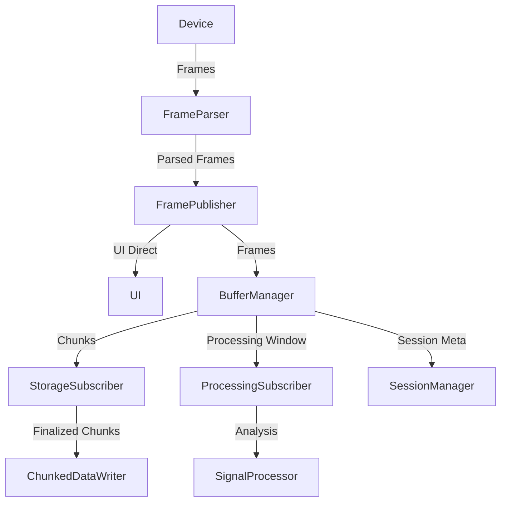

# Sense - Architecture & Application Workflow

This document is the single source of truth for how the Sense data-acquisition
system is structured and how data flows through it, from a device on the wire,
to live visualization, to chunked storage, to post-hoc analysis, annotation, and
export.

## Table of Contents

- [System Overview](#system-overview)
- [Core Components](#core-components)
- [Acquisition Workflow (Data Flow)](#acquisition-workflow-data-flow)
- [Session, Segment & Storage Model](#session-segment--storage-model)
- [Post-hoc Analysis Pipeline](#post-hoc-analysis-pipeline)
- [Annotations](#annotations)
- [Export](#export)
- [Testing the Analysis Worker](#testing-the-analysis-worker)
- [Known Limitations & Future Work](#known-limitations--future-work)
- [Appendix: Architecture Evolution](#appendix-architecture-evolution)

---

## System Overview

Sense is split across two applications that share the same acquisition and
storage model:

- **Sense Web V2** (`apps/sense-web-v2`, Next.js / React) - the user interface
  for live acquisition, device control, real-time visualization, post-hoc
  analysis, annotation, and export. Manages session/segment metadata.
- **Sense Desktop** (`apps/sense-desktop`, Electron) - wraps the Sense Web V2
  app in a native window. Owns device connection (serial/Bluetooth), chunked
  data storage to disk, the Python analysis worker, and all file I/O via IPC.

The guiding principle of the current architecture is **separation of concerns**:

- **Data Acquisition** - `FramePublisher`
- **Data Management** - `BufferManager`, chunking, storage
- **Signal Analysis** - `SignalProcessor` (real-time) and the Python worker (post-hoc)
- **Presentation** - UI visualization, consuming frames directly for low latency

---

## Core Components

| Component | Responsibility |
|---|---|
| **FramePublisher** | Emits parsed frames as events the instant they arrive. Decouples frame arrival from consumers. Publishes to the UI directly (low latency) and to `BufferManager`. |
| **BufferManager** | Single source of truth for streaming state. Owns the storage chunk buffer and the processing window buffer, and notifies subscribers. Handles session start/stop, buffer reset, and chunk finalization. |
| **StorageSubscriber** | Stateless adapter that receives finalized chunks from `BufferManager` and writes them to disk via the Electron `ChunkedDataWriter`. |
| **ProcessingSubscriber** | Stateless adapter that receives the processing window and calls `SignalProcessor` for real-time analysis. *(Scaffolded; no live consumers in current scope, feature extraction is currently post-hoc.)* |
| **SignalProcessor** | Pure signal-processing functions: filtering, feature extraction, and the extensible analysis pipeline. |
| **SessionManager** | Session metadata and segment persistence (localStorage on web / Electron on desktop). Abstracts persistence from the page/components. |
| **ChunkedDataWriter** (Electron) | Writes acquisition frames to disk in chunked JSON files; manages session folders and chunk-file naming. |

**Maintainability invariants:**

- All business logic is decoupled from the UI and the main page/component.
- Subscribers are stateless adapters.
- `BufferManager` is the single source of truth for streaming state.
- `SessionManager` abstracts persistence.

---

## Acquisition Workflow (Data Flow)

The renderer handles **visualization only**. Heavy lifting (buffering, chunking,
storage, processing) happens in the Electron main process and the
`BufferManager`/subscriber layer. The UI is fed directly from `FramePublisher`
so chart updates never block on storage or analysis.

```
Device (Serial/Bluetooth)
    ↓
Frame Parser
    ↓
FramePublisher
    ├→ UI (real-time visualization only, low latency)
    ├→ BufferManager
    │    ├→ StorageSubscriber  → ChunkedDataWriter (chunked disk write)
    │    └→ ProcessingSubscriber → SignalProcessor (real-time analysis window)
    └→ Electron IPC (if applicable)
```



### Step by step

1. **Acquisition start** - user connects a device and starts acquisition from
   the web UI. Electron creates a new session folder and initializes
   `ChunkedDataWriter`; buffers are initialized.
2. **Frame reception** - frames are published; the UI updates immediately while
   `BufferManager` queues them for storage and processing.
3. **Storage** - frames are buffered until a threshold is reached, then flushed
   to Electron in chunks and written to disk.
4. **Processing** - the real-time analysis window is fed to `SignalProcessor`;
   results are available for downstream analysis.
5. **Pause / Resume** - a new segment is started; buffers are maintained; no
   data loss.
6. **Stop** - a final flush is performed, the session is finalized, and metadata
   is saved.

### Reconnection

- Automatic reconnection with exponential backoff in the transport layer.
- `BufferManager` and subscribers reset on reconnect.

---

## Session, Segment & Storage Model

There is a deliberate split between **metadata** and **frame data**:

- **Session metadata** - stored in localStorage (web) / Electron (desktop) by
  `SessionManager`. `session.json` mirrors `SessionManager.createSession`:
  `sessionId, startedAt, endedAt, deviceType, sampleRate, channels[],
  channelNames, channelSignalKinds, adcChars, segments[], chunks[], csvHeader`.
- **Chunked frame storage** - written to disk by Electron, separate from
  metadata.

**Chunking.** Frames are split into `sample1_chunk{0..N-1}.json` files at the
threshold the live `BufferManager` uses, **10,000 frames per chunk** by default
(10 s at 1 kHz). A 60 s session produces 6 chunk files; a 2-hour session ~720.
Each chunk file is a top-level JSON array of frames. The worker reads all of them
via `manifest.chunks`.

**Segments.** On pause/resume a new segment is started; segment and sample
metadata are updated consistently across pause, resume, and stop.

**Robust chunk creation.** After a chunk is finalized, a new chunk file is
created only when there is data to write (on the next write). This prevents
empty chunk files after pause/resume/stop. Guards exist in both the renderer and
main process to prevent chunk writes when there is no data.

---

## Post-hoc Analysis Pipeline

Feature extraction currently runs **post-hoc**, not in real time. The worker
`apps/sense-desktop/python/analysis_worker.py` and its BioSPPy wrapper
`apps/sense-desktop/python/signal_processor.py` run on a finalized session
folder.

### Overall flow

1. Read `session.json` for `sampleRate` and `channelSignalKinds` (channel → kind:
   `ecg, eda, ppg, emg, rsp, eog, eeg, pcg, acc`).
2. Load chunk files and extract, per channel, a 1-D numeric series.
3. For each channel, select the handler by `signalKind` and run libraries per the
   resolved library policy:
   - **BioSPPy** via `signal_processor.process_signal` (default primary for
     `ecg, eda, ppg, emg, rsp, eeg, pcg, acc`).
   - **NeuroKit2** via `analyze_<kind>` wrappers (for `ecg, eda, ppg, emg, rsp,
     eog` when enabled; ECG → HRV when corrected peaks are available).
4. Handlers call the libraries' high-level routines with defaults; the worker
   extracts structured metadata and scalar summaries. Large arrays are pruned
   above `ARRAY_PRESERVE_LIMIT` (10k samples).
5. Outputs are written to the analysis folder.

### Output artifacts

- `analysis-config.json` - resolved run configuration / library policy.
- `analysis-log.csv` - event/timing log (`AnalysisLogger`).
- `analysis.json` - nested per-segment/channel results (per-library blocks,
  `preprocessing`, `outlierRemoval`); large arrays pruned.
- `features.csv` - long format (`library, feature, value`).
- `summary.csv` - one row per segment/channel with high-level stats and which
  libraries ran.
- `README.md` - short human-facing summary of the folder layout.
- `segment-<N>/` - per-segment raw CSVs and per-channel ScientISST
  FileWriter-compatible exports.

### BioSPPy path - `process_signal(kind, values, sample_rate)`

Calls `biosppy.signals.<module>.<fn>(signal=…, sampling_rate=…, show=False)`,
converts the returned `ReturnTuple` to JSON, and reduces numeric arrays to
`count/mean/std/min/max` summaries so they reach `features.csv`.

| Kind | Function | What is stored |
|---|---|---|
| ECG | `biosppy.signals.ecg.ecg` | `ts`, `filtered` (FIR band-pass ≈3–45 Hz), `rpeaks` (Hamilton), `templates`/`templates_ts`, `heart_rate`/`heart_rate_ts` |
| EDA | `biosppy.signals.eda.eda` | `ts`, `filtered`, `onsets`, `peaks`, `amplitudes` (SCR) |
| PPG | `biosppy.signals.ppg.ppg` | `ts`, `filtered`, `onsets`, `heart_rate`/`heart_rate_ts` |
| EMG | `biosppy.signals.emg.emg` | `ts`, `filtered`, `onsets` |
| RSP | `biosppy.signals.resp.resp` | `ts`, `filtered` (≈0.1–0.35 Hz), `zeros`, `resp_rate`/`resp_rate_ts` |
| EEG | `biosppy.signals.eeg.eeg` | `ts`, `filtered`, per-band power (`theta, alpha_low, alpha_high, beta, gamma`), `plf_pairs`/`plf` |
| PCG | `biosppy.signals.pcg.pcg` | `ts`, `filtered`, `peaks`, S1/S2 classification, `heart_rate` |
| ACC | `biosppy.signals.acc.acc` | `ts`, per-axis processed signal, vector magnitude (version-dependent) |

### NeuroKit2 path - `analyze_<kind>`

Each calls `nk.<kind>_process(signal, sampling_rate=…)` → `(signals_df, info)`.
The full `signals_df` is **not** stored (sample-length); only its column names,
the `info` dict (arrays >10k pruned), and, for ECG, the HRV table are kept.

| Kind | Function(s) | Key outputs |
|---|---|---|
| ECG | `nk.ecg_process` → `nk.hrv` | `ECG_Clean`, `ECG_R_Peaks`, `ECG_Rate`, `ECG_Quality`, delineated waves; **HRV** time-domain (`HRV_RMSSD, HRV_SDNN, HRV_pNN50`), frequency (`HRV_LF, HRV_HF, HRV_LFHF`), nonlinear (`HRV_SD1/SD2, HRV_SampEn, HRV_DFA_*`) |
| EDA | `nk.eda_process(method=eda_method)` | `EDA_Clean`, `EDA_Tonic`, `EDA_Phasic`, `SCR_*`. `eda_method` default `cvxEDA`, switchable via `--eda-method` / `SENSE_ANALYSIS_EDA_METHOD` |
| PPG | `nk.ppg_process` | `PPG_Clean`, `PPG_Rate`, `PPG_Peaks`, `PPG_Quality`. **No HRV from PPG** currently |
| EMG | `nk.emg_process` | `EMG_Clean`, `EMG_Amplitude`, `EMG_Activity`, `EMG_Onsets`, `EMG_Offsets` |
| RSP | `nk.rsp_process` | `RSP_Clean`, `RSP_Amplitude`, `RSP_Rate`, `RSP_Phase`, `RSP_Peaks`, `RSP_Troughs`, `RSP_RVT` |
| EOG | `nk.eog_process` → `_extract_eog_features` | `EOG_Clean`, `EOG_Blinks`, `EOG_Rate`; derived `EOG_Blinks_count`, `EOG_Blink_Rate_per_min`, `EOG_IBI_Mean_s`/`SD_s`, `EOG_Rate_Mean/SD/Min/Max` |
| other | `analyze_generic` | raw `count/mean/std/min/max` only |

### The "four operations" (Load · Filter · FE · OR)

| Operation | Status |
|---|---|
| **Load** | Done - custom JSON-chunk loader feeds both libraries |
| **Filter** | Done but **implicit** - inside `biosppy.signals.*` and `nk.*_process`; only EDA's method is exposed; cleaned signals not persisted |
| **FE** | Done for both libraries, all supported kinds |
| **OR (Outlier Removal)** | **Implemented** - library-provided peak correction (`biosppy.signals.ecg.correct_rpeaks`, `neurokit2.signal_fixpeaks`); conditional (needs ≥3 peaks), disable-able via `--disable-outlier-removal` / `SENSE_ANALYSIS_DISABLE_OUTLIER_REMOVAL`. Corrected peaks replace originals; HRV (ECG) is recomputed from corrected peaks |

---

## Annotations

Annotations let a user mark **points** and **intervals** on a recorded session,
classify them with a shared **label dictionary**, and persist them next to the
session for export and downstream analysis. The feature lives in
`apps/sense-web-v2/src/hooks/useAnnotations.ts` (state/persistence) and
`apps/sense-web-v2/src/utils/annotationLabels.ts` (label dictionary), surfaced
on the **Processing** page via `AnnotationsPanel` and `SessionChart`.

### Data model

An annotation (`useAnnotations.ts`):

```ts
interface Annotation {
  id: string                      // uuid
  scope: "channel" | "record"
  channel: string | null
  segment: number                 // 1-based segment index
  t0: number                      // start time in SECONDS (within the segment)
  t1: number                      // end time in seconds; t0 === t1 ⇒ "point"
  labelId: number                 // → AnnotationLabel.id
  note: string                    // free-text
  source: "manual" | "auto"
  creator: string
  createdAt: string               // ISO
  updatedAt: string               // ISO
}
```

- **Time model** is in **seconds**, relative to the start of its segment
  (`t0`/`t1`). `annotationKind(a)` returns `"point"` when `t0 === t1`, else
  `"interval"`.
- Times **snap to the sample grid** (`Math.round(t * sampleRate) / sampleRate`).

### Label dictionary

Labels are the controlled vocabulary annotations reference
(`annotationLabels.ts`):

```ts
interface AnnotationLabel {
  id: number
  name: string
  category: string
  description: string
  color: string                   // hex; used for chart bands & PDF swatches
  appliesTo: "channel" | "segment"
  predefined?: boolean
  retired?: boolean               // tombstone (see below)
}
```

- A **seed set** is provided (`DEFAULT_ANNOTATION_LABELS`): channel-level
  `noise, disturbance, stimulus, onset, offset, peak, baseline, movement` and
  segment-level `healthy, sick`.
- The dictionary is **append-only**. Deleting a label *retires* it
  (`retired: true`) rather than removing it, so existing annotations that
  reference it never dangle. `nextLabelId` is computed from the highest id ever
  seen **including tombstones**, so ids are **never reused**.
- Channel labels are placed on the signal; **segment labels** classify a whole
  segment (`segmentLabels: Record<segment, labelId>`).
- The global dictionary lives in `localStorage`
  (`processing:annotationLabels`); edits are managed in **Settings** via
  `AnnotationLabelsEditor`.

### Session-scoped labels

When a session is opened, the worker reads two sidecars and prefers the
session's own saved labels over the global dictionary:

```
effectiveLabels = sessionLabels ?? globalLabels
```

This means a session imported on another machine renders with the exact label
set it was annotated with, falling back to the local defaults only when the
session carries none.

### Interaction & editing

- **Modes:** `idle` / `point` / `interval`. Click the chart to place; for an
  interval, the first click sets the start, the second sets the end.
- **Keyboard shortcuts:** `P` (point mode), `I` (interval mode), `Esc`
  (cancel), `Delete`/`Backspace` (remove selected), `1`–`9` (pick active label),
  `Ctrl/Cmd+Z` (undo), `Ctrl/Cmd+Shift+Z` or `Ctrl/Cmd+Y` (redo).
- **Undo/redo:** a 100-step history with 700 ms coalescing of same-tag edits.
- Annotations can be re-labelled, noted, moved, and have their bounds dragged;
  `clearAnnotationsInRange` removes only those overlapping a visible window.

### Persistence

`save()` writes two sidecar files into the session folder via Electron IPC:

- **Annotations file** (`writeSessionAnnotations`, `version: 3`) -
  `{ savedAt, annotations[], labels, segmentLabels }`. On save each annotation
  is **anchored** with derived fields for downstream tools:
  `sample = round(t0 * rate)`, `sampleEnd = round(t1 * rate)`, and wall-clock
  `atStartMs`/`atEndMs` computed from the segment's `startedAt`.
- **Labels file** (`writeSessionLabels`, `schemaVersion: 1`) - the effective
  label dictionary snapshot.

Loading reads both back; `discardChanges()` reloads the last saved state from
disk.

---

## Export

Export is centralized in the `useSessionExport(manifest)` hook
(`apps/sense-web-v2/src/hooks/useSessionExport.ts`) and surfaced by
`SessionExportBar`. All exporters read from the **manifest** and the Electron
file APIs, so they work identically for **live** and **imported** sessions.
Export durations are reported via `logPerfEvent`.

There are three user-facing exports plus a legacy summary PDF:

### 1. Raw CSV - `convertToCSV()`

Streams every chunk file into **one CSV per segment**, bundled into a single zip
(`<timestampISO>.zip`). Each CSV is **ScientISST FileWriter-compatible**:

- a `#`-prefixed JSON metadata line (device, channels, sampling rate, ISO 8601
  timestamp, resolution bits),
- a `#NSeq,<channel headers>` line (using stored channel display names),
- one row per frame: sequence number + one column per channel.

Only `sense` and `maker` device types are supported.

### 2. CSV with annotations - `convertToCSVWithAnnotations(annotations, labels)`

Same per-segment CSVs, plus a trailing **`annotation`** column. Each annotation
is converted to a sample range (`round(t * rate)`) for its segment; every frame
whose index falls inside one or more ranges gets those labels (with optional
note), joined by `;`. Output: `<timestampISO>_annotations.zip`.

### 3. Annotated PDF - `convertToAnnotatedPDF(opts)`

A branded, multi-page report for a **chosen segment and time span**, selected in
the **`PdfExportModal`** ("timespan modal"):

- Segment picker (when multiple), **Start (s)** / **End (s)** inputs with
  validation, and an **Include analysis summary** checkbox. Defaults to the
  caller's `defaultRange` or the first 30 s.

The PDF contains:

- **Chart pages** (3 channels/page, landscape A4, d3 + jsPDF, ScientISST fonts
  and logo) rendering the signal over the chosen span, with:
  - **interval annotations** drawn as translucent colored bands (16% opacity)
    behind the trace, and
  - **point/edge markers** as vertical colored lines on top.
  Traces are decimated (`decimateByIndex`, ~2000 points) for size.
- An **Annotations table** page: swatch, label, type (point/interval), time
  (`mm:ss.s`), description, and note.
- An optional **Analysis summary** page. Source preference:
  1. this window's saved analysis (`seg<N>-analysis-window-<start>-<end>`),
  2. the full-session analysis,
  3. otherwise descriptive stats (`mean/median/std/min/max`) computed from the
     window's raw samples - the source is stated on the page.

Filename: `<timestampISO>_annotation_[seg<N>_]<start>_<end>.pdf`.

### 4. Acquisition summary PDF - `convertToPDF()`

The original branded report: a fixed **last-10-seconds** preview per channel
(3/page), loaded via `loadPreviewFrames`. Kept for the acquisition summary page;
the annotated PDF above is the richer, span-selectable version.

### Troubleshooting

| Symptom | Cause | Fix |
|---|---|---|
| `BioSPPy module ... is unavailable` on every channel | missing transitive dep (`peakutils`) | reinstall requirements; `python -c "import biosppy.signals.ecg"` |
| `NeuroKit2 EOG processing failed: ... 'mne' ...` | `mne` not installed | `pip install mne` |
| `HRV_LF` missing | session < ~5 min | re-run with `--duration 300` |
| All summaries zero (real session) | no signal source / device disconnected | re-record with the device attached |
| Worker exits with 1 | see stderr - the worker writes a JSON error blob |

**Not covered by this guide:** the Electron UI flow (record → save → analyse),
the PyInstaller-frozen worker (`build_worker.py`), and real biophysical signal
validity (synthetic signals exercise code paths, not clinical meaning).

---

## Known Limitations & Future Work

1. **High-level library defaults** - the worker uses the libraries' all-in-one
   routines with defaults; it does not hand-compose `clean → peaks → delineate`
   with bespoke parameters.
2. **HRV is ECG-only** - PPG peaks are not passed to `nk.hrv`.
3. **Limited artifact handling** - only library peak-correction
   (`correct_rpeaks`/`signal_fixpeaks`); no quality-index gating, NaN/clipping
   repair, or multi-step artifact rejection.
4. **EEG/ACC multi-channel semantics** - the worker groups channels into
   matrices when they align, but falls back to 1-D per-channel analysis when
   alignment fails; behaviour then depends on the library.
5. **Cleaned/filtered signals not persisted** - they appear in `analysis.json`
   but are pruned above `ARRAY_PRESERVE_LIMIT` (10k); channel CSVs hold raw
   samples.
6. **Real-time feature extraction is scaffolded only** - `ProcessingSubscriber`
   exists but has no live consumers; feature extraction is currently post-hoc.
